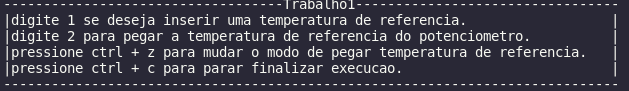

# Projeto 1
Repositório do projeto 1 da disciplina Fundamentos de Sistemas Embarcados, UNB.

Enunciado do projeto disponivel em: https://gitlab.com/fse_fga/projetos_2020_2/projeto-1-2020.2

**Nome**: João Pedro Soares Cirqueira

**Matrícula**: 150132344

## Sistema


## Executando o projeto
```sh
$ git clone https://github.com/jpcirqueira/ControladorTemperatura
$ cd ControladorTemperatura
$ make
$ ./run
```

## Screenshots da execução



Imagem do terminal apos a execucao.

## Resultados

### Grafico 1


Grafico com as temperaturas (Ambiente, Interna e Referência (Potenciômetro)) x tempo de execucão.

### Grafico 2


Grafico com o valor do acionamento dos atuadores (Resistor / Ventoinha) x tempo de execucão.

## Observações

Os resultados gerados estão sendo gravados em um arquivo .csv disponivel apos a execucao em: ```grafico/dados.csv```
